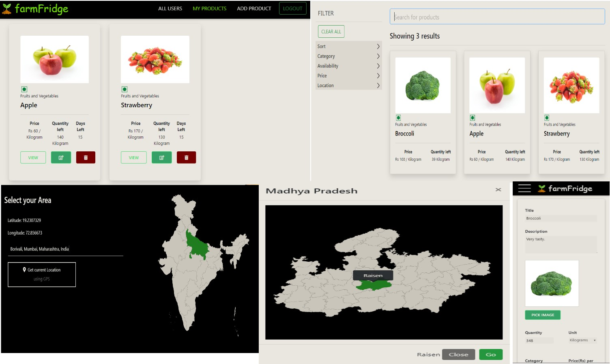

# Farmer-Portal
Online portal for farmers to upload their sell and a dynamic ecommerce webapp where buyers can select what they want from the portal.

# Table of Contents

* [Description](https://github.com/amurto/farmer-portal#description)
* [Dependencies](https://github.com/amurto/farmer-portal#dependencies)
* [Installation](https://github.com/amurto/farmer-portal#installation)
  * [Prerequisites](https://github.com/amurto/farmer-portal#prerequisites)
  * [Instructions](https://github.com/amurto/farmer-portal#instructions)
* [Usage](https://github.com/amurto/farmer-portal#usage)
* [License](https://github.com/amurto/farmer-portal#license)

# Description

- An online portal for farmers to upload their sell and a dynamic ecommerce webapp where buyers can select what they want from the portal. 
- A dynamic ecommerce webapp for the buyers, with product filtering and shopping cart functionalities. 
- For farmers who are not well acquainted with technology, there is a SMS and whatsapp bot where farmers have to register/login and then they can put their crop details on the whatsapp chat or SMS messages, which will be uploaded to the site where buyers can view. 
- The farmers can connect with the buyers and vice versa using this portal. 
- All the data is stored in the database, this data will be used to fuel a data analytics dashboard, where ML and data visualization techniques are used to plot various charts, predict crop prices in the future, forecast trend and various other metrics. 
- This blog is used as an API to answer our chatbot questions as well as online available agricultural sector APIs related to India with the bot. 
- The seller and buyer can negotiate and select the way of exchange of goods, either through a courier client or if the seller wants to send a truck to collect the goods. Dynamic selection is implemented based on location on the webapp.
 
### Website Images



# Dependencies

* [npm](https://www.npmjs.com/)
* [Express.js](https://expressjs.com/)
* [MongoDB](https://reactjs.org/)
* [React.js](https://reactjs.org/)

# Installation

### Prerequisites

Install Node.js and npm using the link above. Follow instructions on their respecive websites. Npm is included with Node.js. Setup MongoDB locally or on [MongoDB Atlas](https://www.mongodb.com/cloud/atlas) and get the connection string. This connection string has to be pasted [here](https://github.com/amurto/farmer-portal/blob/master/Farmer/backend/app.js) for mongoose to connect to the database.

### Instructions

Clone the repository
```bash
git clone https://github.com/amurto/farmer-portal.git
```

Install all the dependencies on backend server
```bash
cd web_app/backend 
npm install
```

Install all the dependencies on farmer client
```bash
cd web_app/farmer
npm install
```

Install all the dependencies on buyer client
```bash
cd web_app/buyer
npm install
```

# Usage

Run the admin server on port 5000
```bash
cd web_app/backend
npm start
```

Run the farmer client
```bash
cd web_app/farmer
npm start
```

Open a web browser and go to
```bash
http://localhost:3000
```
Run the buyer client
```bash
cd web_app/buyer
npm start
```

Open a web browser and go to
```bash
http://localhost:3001
```

# License

[](https://opensource.org/licenses/MIT)

[MIT License Link](https://github.com/amurto/farmer-portal/blob/master/LICENSE)